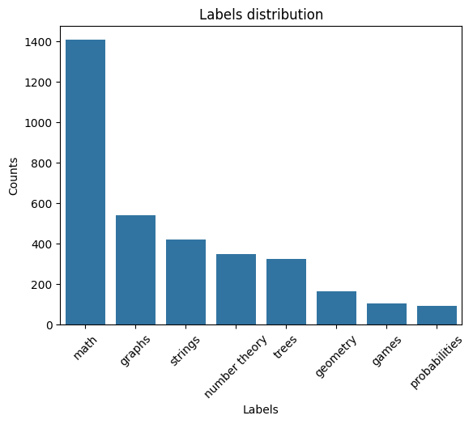
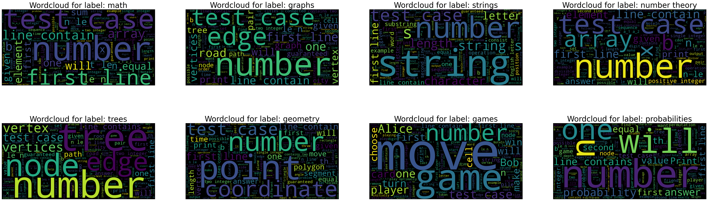
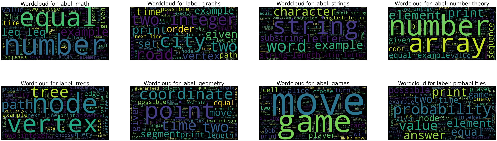
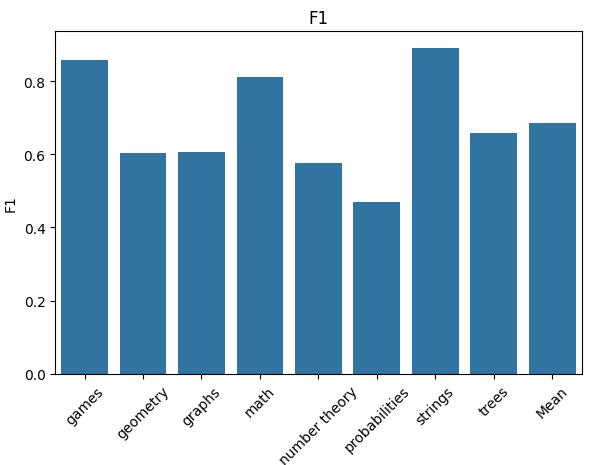

# Codeforces Multilabel Classification 

**Auteur :** Kikia Dia  
**Illuin Technology Challenge :** Data Science

---
### Structure du projet
```
├── notebooks/
│   ├── EDA.ipynb
│   ├── Machine_learning_models.ipynb
│   └── transformers.ipynb
├── src/
│   ├── data_preprocessing.py
│   ├── models.py
│   ├── training.py
│   ├── evaluate.py
│   ├── main.py
│   └── code_features.py
├── models/
│   ├── model.joblib
│   └── model_tfidf.joblib
├── README.md
└── requirements.txt
```
## Contexte

Codeforces est une plateforme de programmation compétitive regroupant des milliers de problèmes d'algorithmique, chacun annoté par plusieurs **tags** représentant les notions algorithmiques mobilisées (`math`, `graphs`, `strings`, etc.).

Ce projet s'appuie sur un **sous-ensemble du dataset xCodeEval** composé de **4 982 problèmes distincts**, incluant :
- `prob_desc_description` : descriptions textuelles complètes ,
- `prob_desc_input_spec`, `prob_desc_output_spec` : spécifications d'entrée/sortie,
- `prob_desc_notes` : notes éventuelles,
- `source_code` : solutions validées en Python,
- `tags` : annotations multi-labels.

## Objectif

Construire un **algorithme de classification multi-label** capable de prédire automatiquement les tags associés à un problème d'algorithmique.

L'étude se concentre sur les **8 tags suivants** :
```python
['math', 'graphs', 'strings', 'number theory',
 'trees', 'geometry', 'games', 'probabilities']
```
Après filtrage pour ne garder que les exemples correspondant à ces tags, le dataset final contient **2 678 problèmes**.

Nombre d'exemples par tag (8 cibles) :
math: 1409,
graphs: 542,
strings: 422
number theory: 350,
trees: 324,
geometry: 166,
games: 105,
probabilities: 92



### Dataset preview

| prob_desc_description | prob_desc_input_spec | prob_desc_output_spec | prob_desc_notes | source_code | tags |
|--------------------|------------------|-------------------|---------------|-------------------|------|
| Once upon a time, Oolimry saw a suffix array... | The first line contain 2 integers $$$n$$$ and ... | Print how many strings produce such a suffix array... | NoteIn the first test case, "abb" is the only ... | import sys\ninput = sys.stdin.readline\n... | [math] |
| You are given an array of n elements, you must... | The first line contains integer n (1 ≤ n ≤ 100...) | Print integer k on the first line — the least ... |  | def gcd(a,b):\n if b==0:return a\n return ... | [number theory, math] |

### Exploratory Data Analysis (EDA)
- Longueur des descriptions, Distribution des tags, Co-occurrence des labels, Wordclouds par tag, Analyse des patterns algorithmiques dans le code
#### Text Preprocessing

- **Champs concatenés  pour la description :** `prob_desc_description`,`prob_desc_input_spec`,`prob_desc_output_spec`, `prob_desc_notes`

- **Nettoyage du texte :** Tokenisation (NLTK), Normalisation, Suppression de stopwords, stemming

- Before preprocessing



- After preprocessing



### Représentation des labels :
- one-hot-encoding avec `MultiLabelBinarizer`

### Data Splitting

Le dataset a été divisé en deux ensembles :
- **Train :** 80% des données (2 142 problèmes)
- **Validation :** 20% des données (536 problèmes)

### Text Vectorisation
- **TF-IDF:**  `max_features = 5000`, `ngram_range = (1, 2)`

## Modélisation

- **Stratégies multi-label :** `One-vs-Rest`, `MultiOutputClassifier`, `Classifier Chains`
- **Classificateurs testés :** `Logistic Regression`,`Random Forest`,`LinearSVC`
- **Métriques d'évaluation :** `Micro F1-score`, `Macro F1-score`, `Hamming Loss`, `Subset Accuracy`, `Precision / Recall par tag`

- **Best Model**: `OneVsRest + LinearSVC (class_weight="balanced")`, Optimisation via `GridSearchCV` , best_params = {'estimator__C': 0.1,'estimator__loss': 'squared_hinge''estimator__max_iter': 1000, 'estimator__tol': 0.0001}

### Approches testées :

- description

- description + features extraits du code Python 

- gestion du déséquilibre avec MLSMOTE (Multi-Label SMOTE)

## Evaluation

### Comparaison des approches (triées par Macro F1)

| Approach | F1 Micro | F1 Macro | Hamming Loss | Subset Accuracy |
|----------|----------|----------|--------------|----------------|
| **Descriptions + code features** | **0.7428** | **0.6969** | **0.0898** | **0.4925** |
| Descriptions only | 0.7139 | 0.6663 | 0.0989 | 0.4459 |
| Resampled (SMOTE) | 0.6978 | 0.6670 | 0.1056 | 0.4216 |

**🏆 Meilleur approche :** Descriptions + code features

### Matrices de confusion


#### f1_score par tag



**best predicted tags** : `math`, `strings`, `games`, `trees`

Pour plus de détails, consultez le notebook d'entraînement `notebooks/Machine_learning_models.ipynb`

---

## Utilisation du CLI

```bash
# training and evaluation on description only

python src/main.py train --data data/train --output models/model.joblib

python src/main.py evaluate --model models/model.joblib --data data/test  

# prediction unitaire 
python src/main.py predict --model models/model.joblib --text """Numbers...."""
```
```bash
# training and evaluation on description + code features 

python src/main.py train --data data/train --output models/model_hybrid.joblib --hybrid

python src/main.py evaluate --model models/model_hybrid.joblib --data data/test --hybrid --results-path results/predictions_test_hybrid.csv

# prediction unitaire 
python src/main.py predict --model models/model_hybrid.joblib --text "Numbers.." --code """ import..."""
```

---

## Autres Pistes d'amélioration

### Modèles Transformers

Des expérimentations ont été menées avec des modèles Transformers pré-entraînés, notamment :
```python
model_names = [
    "microsoft/codebert-base",
    "microsoft/graphcodebert-base",
    "microsoft/unixcoder-base",
    "bert-base-uncased"
]
```

Ces modèles, spécialement conçus pour la compréhension du code (CodeBERT, GraphCodeBERT, UniXcoder) ou du texte naturel (BERT), pourraient potentiellement améliorer les performances en capturant des représentations sémantiques plus riches.

**Comparaison des modèles Transformers (dernière époque)** 

| Modèle                     | F1 Micro | F1 Macro | Hamming Loss | Train Loss | Val Loss | Runtime (s) |
|----------------------------|----------|----------|--------------|------------|----------|------------|
| microsoft/graphcodebert-base | 0.7865  | 0.7394   | 0.0665       | 0.0879     | 0.2050   | 17.41      |
| microsoft/unixcoder-base    | 0.7609  | 0.7276   | 0.0742       | 0.0808     | 0.2200   | 17.28      |
| microsoft/codebert-base     | 0.7618  | 0.6996   | 0.0732       | 0.104      | 0.2101   | 17.16      |
| bert-base-uncased           | 0.7613  | 0.6793   | 0.0730       | 0.1217     | 0.2135   | 17.78      |

remarque : risque d'overfitting, modèles complexes

Pour plus de détails sur les expérimentations avec les Transformers, consultez le notebook : `notebooks/transformers.ipynb`

